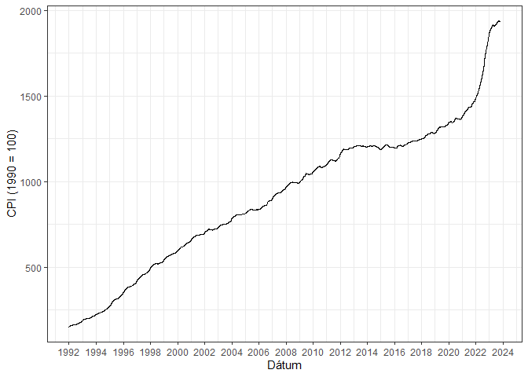

<!-- README.md is generated from README.Rmd. Please edit that file -->

# Infláció - HUF

<!-- badges: start -->

[](https://lifecycle.r-lib.org/articles/stages.html#experimental)
[](https://CRAN.R-project.org/package=PROJECTNAME)
<!-- badges: end -->

A project célja létrehozn egy közérthető adatsort és ehhez tartozó appot
a KSH CPI adatsora alapján (amit a szerző véleménye szerint elég nehéz
megtalálni).

## Összefoglalás

A KSH havi adatsorát átdolgoztam, napi bontásra. Az adatsor excelben az
*inst/backend/calculate_daily_data.xlsx* úton elérhető.

``` r
library(ggplot2)
load( here::here("inst","backend","calculate_daily_data.rdata"))

dat |>
  ggplot( aes( x = time, y = cpi)) +
  theme_bw() +
  theme( legend.position = "none") +
  geom_line()  +
  scale_x_date(date_breaks = "2 years", date_labels = "%Y") +
  labs( x = "Dátum",
        y = "CPI (1990 = 100)")
```



## Lokális verzió futtatása

Az appot az ingyenes Rstudio telepítése után lokáisan is futtathatjuk a
[GitHub](https://github.com/) segítségével.

``` r
# install.packages("devtools")
devtools::install_github("MartynK/MartysProjectTemplate")
```
